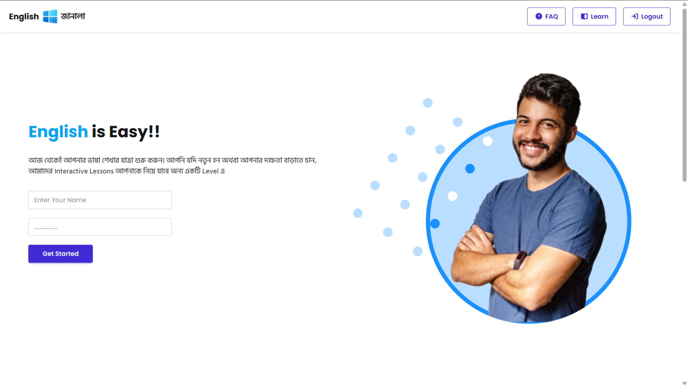

# English Janala – Interactive Vocabulary Learning Platform

English Janala is a responsive web application that helps users explore and learn English vocabulary interactively.  
Users can browse vocabulary by lesson, search for words instantly, and view detailed information including meanings, pronunciations, examples, and synonyms.

This project demonstrates practical implementation of **API integration, asynchronous JavaScript, dynamic DOM manipulation, and responsive UI design**.

---

## Live Demo

🔗 **Live Website:**  
https://english-janala-pro.vercel.app/

---

## Project Preview

## Features

- Browse vocabulary by **lesson**
- **Search vocabulary** instantly
- View **word details in modal**
- **Listen to word pronunciation**
- **Save favorite vocabulary words**
- **Remove saved words anytime**
- Shows **meaning, example, and synonyms**
- **Loading spinner** while fetching data
- Displays **No Word Found** when search results are empty
- Fully **responsive design**

---

## Technologies Used

**Frontend**

- HTML5
- CSS3
- Tailwind CSS
- DaisyUI

**JavaScript**

- ES6+
- Fetch API
- Async / Await
- DOM Manipulation
- Event Handling
- Speech Synthesis API

**Other Tools**

- Font Awesome Icons
- Google Fonts

---

## Technical Highlights

This project demonstrates the following development skills:

- API data fetching and rendering
- Dynamic UI updates using JavaScript
- Vocabulary save & remove functionality
- Speech pronunciation using Web Speech API
- Conditional rendering for empty states
- Search filtering functionality
- Loading state management
- Modal component implementation
- Responsive layout using Tailwind CSS

---

## Project Structure

English-Janala  
│ 
├── index.html 
├── script 
│ └── script.js 
├── style 
│ └── style.css 
├── assets 
│ ├── logo.png 
│ ├── hero-student.png 
│ ├── alert-error.png  
│ └── preview.png   
└── README.md  

---

## API Integration

This project uses the **Programming Hero Open API**.

Base URL: https://openapi.programming-hero.com/api

## Learning Outcomes

Through building this project, the following concepts were practiced:

- Working with REST APIs
- Handling asynchronous JavaScript
- Implementing search functionality
- Creating responsive layouts
- Managing application states (loading, empty results)

---

## Author

**ER Pranto**

GitHub: https://github.com/erpranto55

LinkedIn: https://www.linkedin.com/in/erpranto55/

---

## Support

If you found this project helpful, please consider giving it a **⭐ star on GitHub**.
